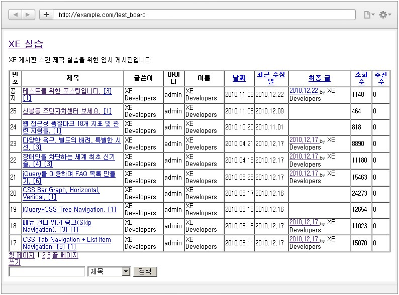

# 게시판 스킨 만들기

- [게시판 스킨이란](../01_about_board_skin)
- [게시판 모듈 설치](../02_install_board_module)
 - [쉬운 설치](../02_install_board_module/autoinstall)
 - [소스 파일 업로드](../02_install_board_module/upload_sources)
- [게시판 스킨의 위치와 필수 파일](../03_board_skin_structure)
 - [게시판 스킨의 위치 확인](../03_board_skin_structure/confirm_directory)
 - [게시판 스킨 필수 파일](../03_board_skin_structure/required_files)
- [게시판 스킨 정보 작성](../04_write_board_skin_info)
- [게시판 생성 및 스킨 적용](../05_make_board_n_apply_skin)
- [게시판 헤더/푸터 작성](../06_write_header_n_footer)
 - [헤더 작성](../06_write_header_n_footer/write_header)
 - [푸터 작성](../06_write_header_n_footer/write_footer)
- 목록 페이지 작성
 - [_header.html, _footer.html 포함(include)](./include_header_n_footer)
 - [게시물이 없을 때 메시지 출력](./show_message_when_no_document)
 - [게시물 목록을 표로 작성](./listing_documents)
 - [게시물 목록 헤더 출력](./print_list_header)
 - [게시물 목록 출력](./print_list)
 - [페이지 번호 링크 출력](./print_page_no)
 - [쓰기 버튼 출력](./print_write_btn)
 - [게시판 검색 입력 양식 출력](./print_search_form)
 - [게시판 목록 화면 출력 결과 확인](./confirm_print_list)
- [쓰기 페이지 작성](../08_write_writing_page)
 - [_header.html, _footer.html 포함(include)](../08_write_writing_page/include_header_n_footer)
 - [쓰기 화면의 HTML 구조](../08_write_writing_page/html_structure_write_form)
 - [쓰기 양식 작성](../08_write_writing_page/write_writing_form)
 - [제목 입력 창 작성](../08_write_writing_page/write_title_form)
 - [내용 입력 창(편집 창) 작성](../08_write_writing_page/write_input_form)
 - [글쓴이 정보 입력 창 작성](../08_write_writing_page/write_author_form)
 - [등록 버튼 출력](../08_write_writing_page/print_write_btn)
 - [쓰기 페이지 출력 결과 확인](../08_write_writing_page/confirm_write_form)
- [읽기 페이지 작성](../09_write_reading_page)
 - [list.html에 _read.html 포함(include)](../09_write_reading_page/include_header_n_footer)
 - [읽기 페이지 구조](../09_write_reading_page/structure_read_form)
 - [제목, 글쓴이 출력](../09_write_reading_page/print_title_n_author)
 - [조회수, 추천 수, 날짜 출력](../09_write_reading_page/print_num_list)
 - [게시물 본문 출력](../09_write_reading_page/print_content)
 - [첨부 파일 출력](../09_write_reading_page/print_attach_files)
 - [목록, 수정, 삭제 버튼 출력](../09_write_reading_page/print_btns)
 - [엮인글 목록, 댓글 목록 포함(include)](../09_write_reading_page/include_trackback_n_comment_list)
 - [게시물에 대한 댓글 입력 양식 출력](../09_write_reading_page/print_input_comment_form)
- [엮인글/댓글 관련 페이지 작성](../10_write_trackback_n_comment_page)
 - [엮인글 목록 작성](../10_write_trackback_n_comment_page/write_trackback_form)
 - [댓글 목록 작성](../10_write_trackback_n_comment_page/write_comment_form)
 - [댓글의 댓글 쓰기 및 댓글 수정 페이지 작성](../10_write_trackback_n_comment_page/write_recomment_n_edit_form)
- [삭제 페이지 작성](../11_write_deleting_page)
 - [게시물 삭제 페이지 작성](../11_write_deleting_page/write_delete_document_form)
 - [댓글 삭제 페이지 작성](../11_write_deleting_page/write_delete_comment_form)
 - [엮인글 삭제 페이지 작성](../11_write_deleting_page/write_delete_trackback_form)
- [권한 안내 페이지 작성](../12_write_grant_page)
- [비밀번호 입력 페이지 작성](../13_write_password_page)

## 목록 페이지 작성

게시판에 접근했을 때 처음 보이는 페이지는 게시물 목록을 보여주는 목록 페이지입니다. 목록 페이지는 *list.html*에서 작성합니다.

다음은 예제 게시판 스킨으로 만든 목록 페이지의 완성 화면입니다. 게시판 헤더에서 작성한 대로 **XE 실습**이라는 게시판 제목과 **XE 게시판 스킨 제작 실습을 위한 임시 게시판입니다.**라는 게시판 상세 설명이 게시판 윗부분에 항상 표시됩니다.

위의 게시판 목록 페이지는 가능한 모든 칼럼 항목을 표시하도록 설정한 상태입니다. 게시판 관리자가 목록 페이지에서 어떤 항목을 표시하려고 할지 알 수 없기 때문에 스킨을 만들 때 모든 항목을 출력하도록 설정하는 것이 좋습니다.

*list.html*을 작성하는 방법은 하위 항목에서 설명합니다.
