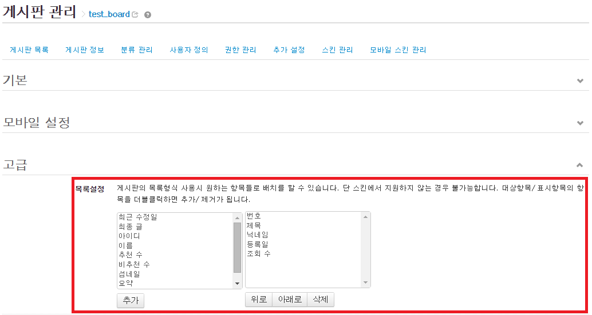

# 게시판 스킨 만들기

- [게시판 스킨이란](../../01_about_board_skin)
- [게시판 모듈 설치](../../02_install_board_module)
 - [쉬운 설치](../../02_install_board_module/autoinstall)
 - [소스 파일 업로드](../../02_install_board_module/upload_sources)
- [게시판 스킨의 위치와 필수 파일](../../03_board_skin_structure)
 - [게시판 스킨의 위치 확인](../../03_board_skin_structure/confirm_directory)
 - [게시판 스킨 필수 파일](../../03_board_skin_structure/required_files)
- [게시판 스킨 정보 작성](../../04_write_board_skin_info)
- [게시판 생성 및 스킨 적용](../../05_make_board_n_apply_skin)
- [게시판 헤더/푸터 작성](../../06_write_header_n_footer)
 - [헤더 작성](../../06_write_header_n_footer/write_header)
 - [푸터 작성](../../06_write_header_n_footer/write_footer)
- [목록 페이지 작성](../)
 - [_header.html, _footer.html 포함(include)](../include_header_n_footer)
 - [게시물이 없을 때 메시지 출력](../show_message_when_no_document)
 - [게시물 목록을 표로 작성](../listing_documents)
 - 게시물 목록 헤더 출력
 - [게시물 목록 출력](../print_list)
 - [페이지 번호 링크 출력](../print_page_no)
 - [쓰기 버튼 출력](../print_write_btn)
 - [게시판 검색 입력 양식 출력](../print_search_form)
 - [게시판 목록 화면 출력 결과 확인](../confirm_print_list)
- [쓰기 페이지 작성](../../08_write_writing_page)
 - [_header.html, _footer.html 포함(include)](../../08_write_writing_page/include_header_n_footer)
 - [쓰기 화면의 HTML 구조](../../08_write_writing_page/html_structure_write_form)
 - [쓰기 양식 작성](../../08_write_writing_page/write_writing_form)
 - [제목 입력 창 작성](../../08_write_writing_page/write_title_form)
 - [내용 입력 창(편집 창) 작성](../../08_write_writing_page/write_input_form)
 - [글쓴이 정보 입력 창 작성](../../08_write_writing_page/write_author_form)
 - [등록 버튼 출력](../../08_write_writing_page/print_write_btn)
 - [쓰기 페이지 출력 결과 확인](../../08_write_writing_page/confirm_write_form)
- [읽기 페이지 작성](../../09_write_reading_page)
 - [list.html에 _read.html 포함(include)](../../09_write_reading_page/include_header_n_footer)
 - [읽기 페이지 구조](../../09_write_reading_page/structure_read_form)
 - [제목, 글쓴이 출력](../../09_write_reading_page/print_title_n_author)
 - [조회수, 추천 수, 날짜 출력](../../09_write_reading_page/print_num_list)
 - [게시물 본문 출력](../../09_write_reading_page/print_content)
 - [첨부 파일 출력](../../09_write_reading_page/print_attach_files)
 - [목록, 수정, 삭제 버튼 출력](../../09_write_reading_page/print_btns)
 - [엮인글 목록, 댓글 목록 포함(include)](../../09_write_reading_page/include_trackback_n_comment_list)
 - [게시물에 대한 댓글 입력 양식 출력](../../09_write_reading_page/print_input_comment_form)
- [엮인글/댓글 관련 페이지 작성](../../10_write_trackback_n_comment_page)
 - [엮인글 목록 작성](../../10_write_trackback_n_comment_page/write_trackback_form)
 - [댓글 목록 작성](../../10_write_trackback_n_comment_page/write_comment_form)
 - [댓글의 댓글 쓰기 및 댓글 수정 페이지 작성](../../10_write_trackback_n_comment_page/write_recomment_n_edit_form)
- [삭제 페이지 작성](../../11_write_deleting_page)
 - [게시물 삭제 페이지 작성](../../11_write_deleting_page/write_delete_document_form)
 - [댓글 삭제 페이지 작성](../../11_write_deleting_page/write_delete_comment_form)
 - [엮인글 삭제 페이지 작성](../../11_write_deleting_page/write_delete_trackback_form)
- [권한 안내 페이지 작성](../../12_write_grant_page)
- [비밀번호 입력 페이지 작성](../../13_write_password_page)

## 게시물 목록 헤더 출력

게시물 목록 헤더란 번호, 제목, 글쓴이, 날짜, 조회 수와 같은 내용의 제목 셀입니다. 게시판 관리자가 어떤 항목을 표시할 것인지 알 수 없기 때문에 스킨 제작자는 게시판 모듈이 지원하는 대부분의 내용을 조건문으로 작성해 두는 것이 좋습니다.

예를 들어, 게시판 관리자는 XE 관리자 페이지의 *고급 > 설치된 모듈 > 게시판*에서 설정을 클릭하고 목록설정을 열어 모든 항목을 표시하도록 설정할 수 있습니다. 이때 스킨에서 모든 항목을 지원하지 않으면 게시판 관리자는 스킨에 문제가 있는 것으로 오해할 수 있습니다.



XE 게시판 모듈은 기본적으로 위와 같이 12가지 정보를 목록 화면에 출력할 수 있습니다. 섬네일과 요약 내용은 통상 별도의 칼럼으로 두지 않고 제목 셀에 함께 출력하기 때문에 게시물 목록의 칼럼 개수에 포함시키지 않습니다. 따라서 모든 항목을 표시할 수 있도록 지원하려면 10가지 항목에 대한 조건문을 작성해야 합니다. 게시판 관리자가 모든 항목을 표시하도록 설정하는 경우 총 10개의 칼럼이 생성됩니다.

예제 게시판 스킨의 *list.html*에서는 다음과 같이 `<thead>` 요소 내부에 10가지 항목에 대한 조건문을 작성했습니다.

```html
...
<thead>
    <!-- LIST HEADER -->
    <tr>
        <block loop="$list_config=>$key,$val">
        <th scope="col" cond="$val->type=='no'">{$lang->no}</th>
        <th scope="col" class="title" cond="$val->type=='title'">{$lang->title}</th>
        <th scope="col" cond="$val->type=='nick_name'">{$lang->writer}</th>
        <th scope="col" cond="$val->type=='user_id'">{$lang->user_id}</th>
        <th scope="col" cond="$val->type=='user_name'">{$lang->user_name}</th>
        <th scope="col" cond="$val->type=='regdate'"><a href="{getUrl('sort_index','regdate','order_type',$order_type)}">{$lang->date}</a></th>
        <th scope="col" cond="$val->type=='last_update'"><a href="{getUrl('sort_index','last_update','order_type',$order_type)}">{$lang->last_update}</a></th>
        <th scope="col" cond="$val->type=='last_post'"><a href="{getUrl('sort_index','last_update','order_type',$order_type)}">{$lang->last_post}</a></th>
        <th scope="col" cond="$val->type=='readed_count'"><a href="{getUrl('sort_index','readed_count','order_type',$order_type)}">{$lang->readed_count}</a></th>
        <th scope="col" cond="$val->type=='voted_count'"><a href="{getUrl('sort_index','voted_count','order_type',$order_type)}">{$lang->voted_count}</a></th>
        </block>
    </tr>
    <!-- /LIST HEADER -->
</thead>
...
```

위 코드에서 사용된 템플릿 문법과 변수는 다음과 같습니다.

|XE 템플릿 문법/변수|설명|
|---|---|
|`<block loop="$list_config=>$key,$val">...</block>`|표시 항목을 출력|
|`<th scope="col" cond="$val->type=='no'">{$lang->no}</th>`|게시물 번호|
|`<th scope="col" class="title" cond="$val->type=='title'">{$lang->title}</th>`|게시물 제목|
|`<th scope="col" cond="$val->type=='nick_name'">{$lang->writer}</th>`|글쓴이|
|`<th scope="col" cond="$val->type=='user_id'">{$lang->user_id}</th>`|아이디|
|`<th scope="col" cond="$val->type=='user_name'">{$lang->user_name}</th>`|이름|
|`<th scope="col" cond="$val->type=='regdate'">...</th>`|날짜(정렬 순서 변경 가능)|
|`<th scope="col" cond="$val->type=='last_update'">...</th>`|최근 수정일(정렬 순서 변경 가능)|
|`<th scope="col" cond="$val->type=='last_post'">...</th>`|최종 글(정렬 순서 변경 가능)|
|`<th scope="col" cond="$val->type=='readed_count'">...</th>`|조회 수(정렬 순서 변경 가능)|
|`<th scope="col" cond="$val->type=='voted_count'">...</th>`|추천 수(정렬 순서 변경 가능)|
