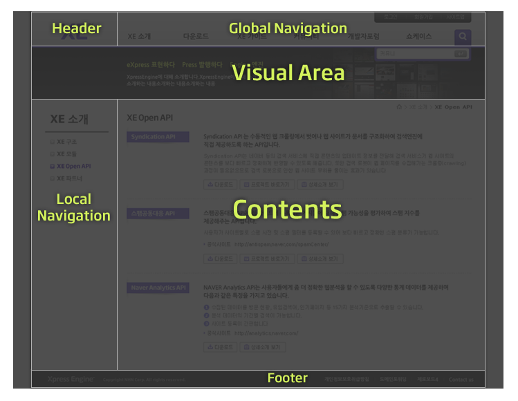

# 레이아웃 스킨 만들기

- 레이아웃 스킨이란
- [레이아웃 스킨의 위치와 디렉터리 구조](../02_layout_structure)
 - [레이아웃 스킨의 위치 확인](../02_layout_structure/confirm_directory)
 - [레이아웃 스킨 디렉터리 구조](../02_layout_structure/directory_structure)
- [레이아웃 스킨 정보 작성](../03_write_layout_info)
- [레이아웃 생성](../04_make_layout_instance)
 - [사용자 정의 레이아웃 확인](../04_make_layout_instance/confirm_user_defined_layout)
 - [레이아웃 사본 생성](../04_make_layout_instance/copy_layout)
- [레이아웃 스킨 작성](../05_write_layout)
 - [레이아웃 스킨의 문서 구조](../05_write_layout/layout_structure)
 - [{$content} 변수로 본문 출력](../05_write_layout/print_content)
 - [글로벌 메뉴 출력](../05_write_layout/print_global_menu)
 - [로컬 메뉴 출력](../05_write_layout/print_local_menu)
 - [통합검색 양식 출력](../05_write_layout/print_search_form)
 - [로그인 양식 출력](../05_write_layout/print_login_form)
- [사이트맵 작성](../06_write_sitemap)
- [레이아웃에 사이트맵 연결](../07_link_sitemap)
- [페이지 모듈에 레이아웃 연결](../08_link_layout)
 - [페이지 생성](../08_link_layout/make_page)
 - [페이지 확인](../08_link_layout/confirm_page)
 - [페이지 수정](../08_link_layout/edit_page)

## 레이아웃 스킨이란

XE는 레이아웃과 콘텐츠가 분리되어 있습니다. 레이아웃은 XE 콘텐츠를 담아내는 구조체 또는 얼개입니다.

일반적인 웹 사이트는 헤더, 글로벌 내비게이션, 로컬 내비게이션, 콘텐츠, 푸터 형식으로 구성되어 있는데, 이런 요소의 화면 배치를 결정하는 것이 바로 레이아웃 스킨의 역할입니다.

만약 게시판, 위키와 같은 특정 콘텐츠를 사용자에게 보여줄 때 다른 콘텐츠는 보여줄 필요가 없다면 레이아웃 스킨을 사용하지 않아도 됩니다. 그러나 게시판, 위키와 같은 콘텐츠 이외에 웹 사이트를 일관성 있게 탐색할 수 있도록 헤더, 글로벌 내비게이션, 로컬 내비게이션, 푸터 영역 등을 배치해야 한다면 레이아웃 스킨이 반드시 있어야 합니다.

다음은 레이아웃 스킨을 사용한 일반적인 화면 구성을 나타낸 것입니다.

XE core는 하나 이상의 레이아웃 스킨을 포함하고 있습니다. 기본으로 포함되어 있는 레이아웃 스킨은 XE core가 설치된 경로의 */layouts/*에 있습니다. 스킨 제작자는 XE core에 포함된 기본 레이아웃 스킨을 사용하거나 새로 만들 수도 있습니다.
