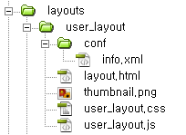

# 레이아웃 스킨 만들기

- [레이아웃 스킨이란](../../01_about_layout)
- [레이아웃 스킨의 위치와 디렉터리 구조](../)
 - [레이아웃 스킨의 위치 확인](../confirm_directory)
 - 레이아웃 스킨 디렉터리 구조
- [레이아웃 스킨 정보 작성](../../03_write_layout_info)
- [레이아웃 생성](../../04_make_layout_instance)
 - [사용자 정의 레이아웃 확인](../../04_make_layout_instance/confirm_user_defined_layout)
 - [레이아웃 사본 생성](../../04_make_layout_instance/copy_layout)
- [레이아웃 스킨 작성](../../05_write_layout)
 - [레이아웃 스킨의 문서 구조](../../05_write_layout/layout_structure)
 - [{$content} 변수로 본문 출력](../../05_write_layout/print_content)
 - [글로벌 메뉴 출력](../../05_write_layout/print_global_menu)
 - [로컬 메뉴 출력](../../05_write_layout/print_local_menu)
 - [통합검색 양식 출력](../../05_write_layout/print_search_form)
 - [로그인 양식 출력](../../05_write_layout/print_login_form)
- [사이트맵 작성](../../06_write_sitemap)
- [레이아웃에 사이트맵 연결](../../07_link_sitemap)
- [페이지 모듈에 레이아웃 연결](../../08_link_layout)
 - [페이지 생성](../../08_link_layout/make_page)
 - [페이지 확인](../../08_link_layout/confirm_page)
 - [페이지 수정](../../08_link_layout/edit_page)

## 레이아웃 스킨 디렉터리 구조

레이아웃 스킨을 제작할 때 반드시 갖추어야 할 디렉터리 구조가 있습니다. 이 구조를 유지하지 않으면 레이아웃 스킨이 될 수 없습니다.

일반적인 레이아웃 스킨의 구조는 다음과 같습니다.



**info.xml**
info.xml은 레이아웃 스킨의 기본 정보들을 포함하며 관리자 화면에 보여줄 설명과 옵션을 제공합니다. info.xml은 반드시 다음 경로에 존재해야 합니다. *conf* 디렉터리 이름과 *info.xml* 파일 이름은 변경할 수 없습니다.

```
/xe/layouts/user_layout/conf/info.xml
```

**layout.html**
*layout.html*은 레이아웃 스킨의 HTML과 CSS, JS 참조 정보를 포함합니다. *layout.html* 파일 이름은 변경할 수 없습니다.

```
/xe/layouts/user_layout/layout.html
```

**thumbnail.png**
*thumbnail.png*는 레이아웃 미리보기용 이미지 파일입니다. 너비 180픽셀, 높이 120픽셀 이상 크기로 제작하여 넣어두면 관리자 화면에서 미리보기 이미지로 출력합니다. *thumbnail.png*라는 파일 이름은 변경할 수 없습니다.

```
/xe/layouts/user_layout/thumbnail.png
```

**CSS, JS, IMG**
CSS, JS, IMG 파일은 레이아웃 스킨의 필수 요소가 아니므로 필요에 따라 생성해서 사용합니다. *conf* 디렉터리를 제외한 어느 곳에 위치해도 무방합니다. 관리해야 할 파일의 수가 많아지면 레이아웃 스킨 디렉터리 아래에 *css*, *js*, *img*와 같은 이름의 디렉터리를 추가로 생성해서 관리할 수 있습니다.
