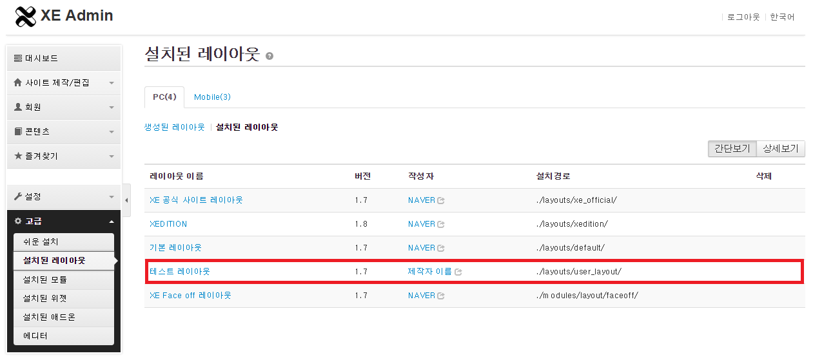

# 레이아웃 스킨 만들기

- [레이아웃 스킨이란](../../01_about_layout)
- [레이아웃 스킨의 위치와 디렉터리 구조](../../02_layout_structure)
 - [레이아웃 스킨의 위치 확인](../../02_layout_structure/confirm_directory)
 - [레이아웃 스킨 디렉터리 구조](../../02_layout_structure/directory_structure)
- [레이아웃 스킨 정보 작성](../../03_write_layout_info)
- [레이아웃 생성](../)
 - 사용자 정의 레이아웃 확인
 - [레이아웃 사본 생성](../copy_layout)
- [레이아웃 스킨 작성](../../05_write_layout)
 - [레이아웃 스킨의 문서 구조](../../05_write_layout/layout_structure)
 - [{$content} 변수로 본문 출력](../../05_write_layout/print_content)
 - [글로벌 메뉴 출력](../../05_write_layout/print_global_menu)
 - [로컬 메뉴 출력](../../05_write_layout/print_local_menu)
 - [통합검색 양식 출력](../../05_write_layout/print_search_form)
 - [로그인 양식 출력](../../05_write_layout/print_login_form)
- [사이트맵 작성](../../06_write_sitemap)
- [레이아웃에 사이트맵 연결](../../07_link_sitemap)
- [페이지 모듈에 레이아웃 연결](../../08_link_layout)
 - [페이지 생성](../../08_link_layout/make_page)
 - [페이지 확인](../../08_link_layout/confirm_page)
 - [페이지 수정](../../08_link_layout/edit_page)

## 사용자 정의 레이아웃 확인

*info.xml*을 올바르게 작성했는지 확인하는 방법은 다음과 같습니다.

1. XE 관리자 페이지에서 *고급 > 설치된 레이아웃*을 엽니다.
2. 테스트 레이아웃이 제대로 표시되는지 확인합니다.

