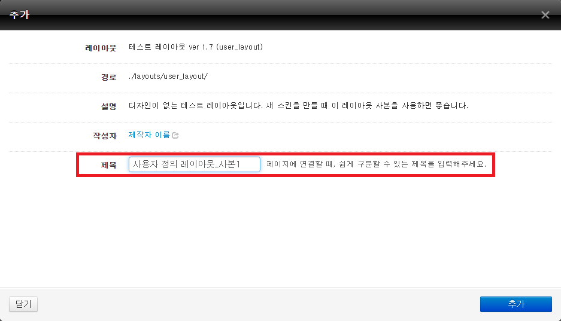

# 레이아웃 스킨 만들기

- [레이아웃 스킨이란](../../01_about_layout)
- [레이아웃 스킨의 위치와 디렉터리 구조](../../02_layout_structure)
 - [레이아웃 스킨의 위치 확인](../../02_layout_structure/confirm_directory)
 - [레이아웃 스킨 디렉터리 구조](../../02_layout_structure/directory_structure)
- [레이아웃 스킨 정보 작성](../../03_write_layout_info)
- [레이아웃 생성](../)
 - [사용자 정의 레이아웃 확인](../confirm_user_defined_layout)
 - 레이아웃 사본 생성
- [레이아웃 스킨 작성](../../05_write_layout)
 - [레이아웃 스킨의 문서 구조](../../05_write_layout/layout_structure)
 - [{$content} 변수로 본문 출력](../../05_write_layout/print_content)
 - [글로벌 메뉴 출력](../../05_write_layout/print_global_menu)
 - [로컬 메뉴 출력](../../05_write_layout/print_local_menu)
 - [통합검색 양식 출력](../../05_write_layout/print_search_form)
 - [로그인 양식 출력](../../05_write_layout/print_login_form)
- [사이트맵 작성](../../06_write_sitemap)
- [레이아웃에 사이트맵 연결](../../07_link_sitemap)
- [페이지 모듈에 레이아웃 연결](../../08_link_layout)
 - [페이지 생성](../../08_link_layout/make_page)
 - [페이지 확인](../../08_link_layout/confirm_page)
 - [페이지 수정](../../08_link_layout/edit_page)

## 레이아웃 사본 생성

설치된 레이아웃인 *테스트 레이아웃*에서 레이아웃 *사본*을 생성해야 비로소 사용할 수 있는 상태가 됩니다. 사용자는 *user_layout*이라는 사본을 여러 개 반복해서 생성할 수도 있습니다.

레이아웃 사본을 생성하는 방법은 다음과 같습니다.

1. 테스트 레이아웃 페이지를 열고 추가를 클릭합니다.
2. 제목에 사본의 이름을 입력하고 추가를 클릭합니다. 제목은 *user_layout*의 또 다른 사본과 구별할 수 있게 입력해야 합니다. 이 예제에서는 테스트 레이아웃 사본 이름으로 *사용자 정의 레이아웃_사본1*을 입력했습니다.
3. 테스트 레이아웃 페이지에서 다음과 같이 *사용자 정의 레이아웃_사본1*이 생성된 것을 확인할 수 있습니다.

이제 이 레이아웃을 사용하고자 하는 모듈의 설정 화면에서 *사용자 정의 레이아웃_사본1*을 선택할 수 있습니다.

> *layout.html*을 생성하지 않은 상태에서 이 레이아웃을 적용한 모듈 페이지에 접근하면 *Err : "./layouts/user_layout/layout.html" template file does not exist.* 오류 메시지가 화면에 출력됩니다.
