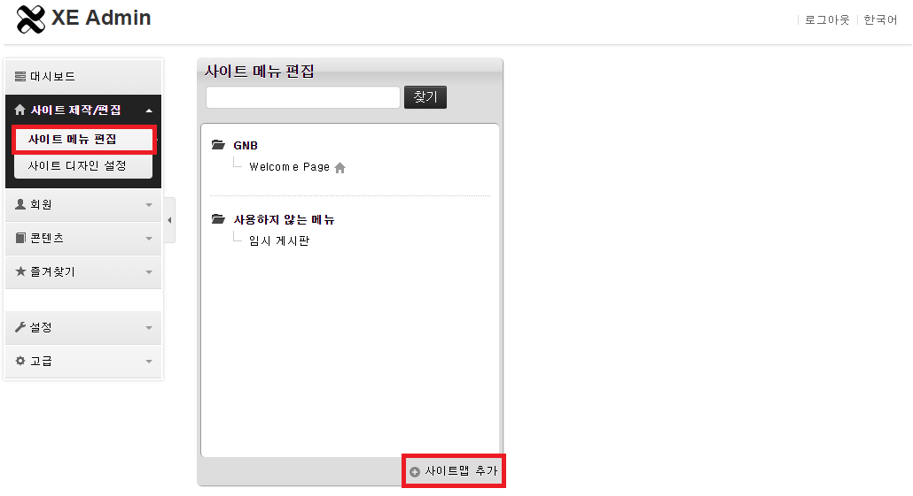

# 레이아웃 스킨 만들기

- [레이아웃 스킨이란](../01_about_layout)
- [레이아웃 스킨의 위치와 디렉터리 구조](../02_layout_structure)
 - [레이아웃 스킨의 위치 확인](../02_layout_structure/confirm_directory)
 - [레이아웃 스킨 디렉터리 구조](../02_layout_structure/directory_structure)
- [레이아웃 스킨 정보 작성](../03_write_layout_info)
- [레이아웃 생성](../04_make_layout_instance)
 - [사용자 정의 레이아웃 확인](../04_make_layout_instance/confirm_user_defined_layout)
 - [레이아웃 사본 생성](../04_make_layout_instance/copy_layout)
- [레이아웃 스킨 작성](../05_write_layout)
 - [레이아웃 스킨의 문서 구조](../05_write_layout/layout_structure)
 - [{$content} 변수로 본문 출력](../05_write_layout/print_content)
 - [글로벌 메뉴 출력](../05_write_layout/print_global_menu)
 - [로컬 메뉴 출력](../05_write_layout/print_local_menu)
 - [통합검색 양식 출력](../05_write_layout/print_search_form)
 - [로그인 양식 출력](../05_write_layout/print_login_form)
- 사이트맵 작성
- [레이아웃에 사이트맵 연결](../07_link_sitemap)
- [페이지 모듈에 레이아웃 연결](../08_link_layout)
 - [페이지 생성](../08_link_layout/make_page)
 - [페이지 확인](../08_link_layout/confirm_page)
 - [페이지 수정](../08_link_layout/edit_page)

## 사이트맵 작성

사이트맵은 사이트 메뉴를 의미합니다. XE 관리자 페이지에서 사이트맵을 생성하고 원하는 레이아웃 사본과 연결하면 레이아웃이 출력될 때 사이트맵을 메뉴로 출력할 수 있습니다.

사이트맵을 생성하는 방법은 다음과 같습니다.

1. XE 관리자 페이지에서 *사이트 제작/편집 > 사이트 메뉴 편집*을 선택합니다.
2. 사이트맵 페이지에서 *사이트맵 추가*를 클릭합니다.

사이트맵은 여러 세트를 추가로 생성할 수 있는데 레이아웃과 연결할 때 다른 사이트맵과 구별할 수 있도록 제목을 반드시 입력해야 합니다.

1. 사이트맵 이름에 *사이트맵*이라고 입력하고 저장을 클릭합니다.
2. *사이트맵*에서 메뉴 추가를 클릭하고 웹 사이트의 글로벌 메뉴 구조를 완성합니다.

아직은 *사이트맵*이라는 메뉴를 사용자 화면에서 볼 수 없습니다. 레이아웃에서 메뉴를 참조해야만 사용자 화면에 출력됩니다.

> 메뉴를 생성하는 과정에서 모듈 또는 URL 항목에는 유효한 모듈 아이디 또는 연결 URL을 지정해야 합니다. 모듈 아이디 또는 연결 URL이 유효하지 않으면 레이아웃에서 메뉴가 정상적으로 표시되지 않을 수 있습니다.
