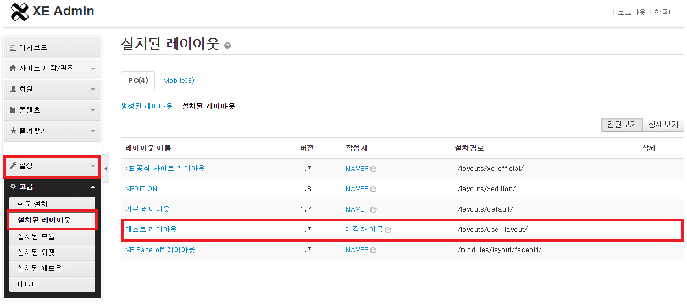
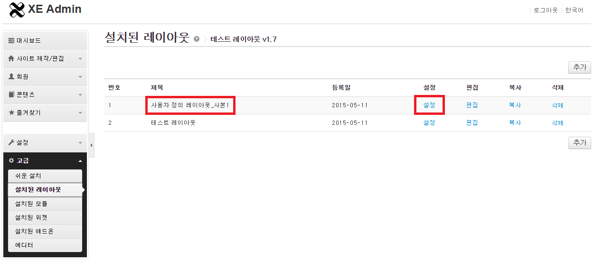
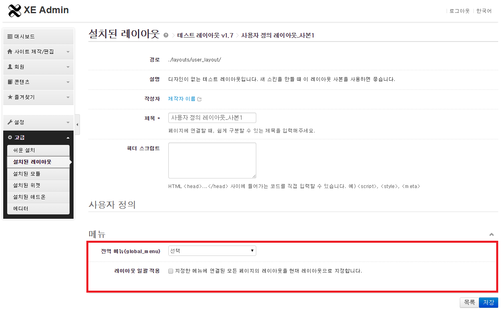

# 레이아웃 스킨 만들기

- [레이아웃 스킨이란](../01_about_layout)
- [레이아웃 스킨의 위치와 디렉터리 구조](../02_layout_structure)
 - [레이아웃 스킨의 위치 확인](../02_layout_structure/confirm_directory)
 - [레이아웃 스킨 디렉터리 구조](../02_layout_structure/directory_structure)
- [레이아웃 스킨 정보 작성](../03_write_layout_info)
- [레이아웃 생성](../04_make_layout_instance)
 - [사용자 정의 레이아웃 확인](../04_make_layout_instance/confirm_user_defined_layout)
 - [레이아웃 사본 생성](../04_make_layout_instance/copy_layout)
- [레이아웃 스킨 작성](../05_write_layout)
 - [레이아웃 스킨의 문서 구조](../05_write_layout/layout_structure)
 - [{$content} 변수로 본문 출력](../05_write_layout/print_content)
 - [글로벌 메뉴 출력](../05_write_layout/print_global_menu)
 - [로컬 메뉴 출력](../05_write_layout/print_local_menu)
 - [통합검색 양식 출력](../05_write_layout/print_search_form)
 - [로그인 양식 출력](../05_write_layout/print_login_form)
- [사이트맵 작성](../06_write_sitemap)
- 레이아웃에 사이트맵 연결
- [페이지 모듈에 레이아웃 연결](../08_link_layout)
 - [페이지 생성](../08_link_layout/make_page)
 - [페이지 확인](../08_link_layout/confirm_page)
 - [페이지 수정](../08_link_layout/edit_page)

## 레이아웃에 사이트맵 연결

*사이트맵*라는 사이트맵이 생성되었기 때문에 이제는 레이아웃에서 이 사이트맵을 참조할 수 있습니다. 레이아웃에 *사이트맵*을 연결하는 방법은 다음과 같습니다.

1. XE 관리자 페이지에서 *고급 > 설치된 레이아웃*을 선택합니다.
2. *테스트 레이아웃* 항목을 열고 *사용자 정의 레이아웃_사본1*의 설정을 선택합니다.
3. *메뉴 > 전역 메뉴(global_menu)*에서 *사이트맵*을 선택하고 레이아웃 일괄 적용을 선택한 다음 저장을 클릭합니다.

> 레이아웃 일괄 적용을 선택하면 메뉴를 통해서 연결되어 있는 모든 모듈의 레이아웃이 현재의 레이아웃으로 한 번에 변경됩니다. 이후 *사이트맵*은 항상 이 레이아웃과 함께 출력됩니다.

