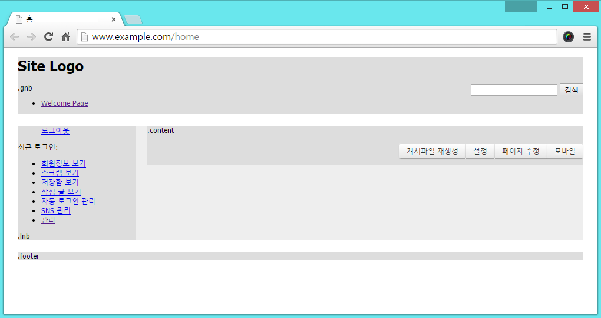

# 레이아웃 스킨 만들기

- [레이아웃 스킨이란](../../01_about_layout)
- [레이아웃 스킨의 위치와 디렉터리 구조](../../02_layout_structure)
 - [레이아웃 스킨의 위치 확인](../../02_layout_structure/confirm_directory)
 - [레이아웃 스킨 디렉터리 구조](../../02_layout_structure/directory_structure)
- [레이아웃 스킨 정보 작성](../../03_write_layout_info)
- [레이아웃 생성](../../04_make_layout_instance)
 - [사용자 정의 레이아웃 확인](../../04_make_layout_instance/confirm_user_defined_layout)
 - [레이아웃 사본 생성](../../04_make_layout_instance/copy_layout)
- [레이아웃 스킨 작성](../../05_write_layout)
 - [레이아웃 스킨의 문서 구조](../../05_write_layout/layout_structure)
 - [{$content} 변수로 본문 출력](../../05_write_layout/print_content)
 - [글로벌 메뉴 출력](../../05_write_layout/print_global_menu)
 - [로컬 메뉴 출력](../../05_write_layout/print_local_menu)
 - [통합검색 양식 출력](../../05_write_layout/print_search_form)
 - [로그인 양식 출력](../../05_write_layout/print_login_form)
- [사이트맵 작성](../../06_write_sitemap)
- [레이아웃에 사이트맵 연결](../../07_link_sitemap)
- [페이지 모듈에 레이아웃 연결](../)
 - [페이지 생성](../make_page)
 - 페이지 확인
 - [페이지 수정](../edit_page)

## 페이지 확인

생성된 페이지를 사용자 화면에서 접근하면 레이아웃 스킨이 적용된 결과를 확인할 수 있습니다. 모듈 ID를 *home*이라고 작성했기 때문에 이 페이지의 접근 경로는 다음과 같습니다. 아래 경로에서 *www.example.com*은 사용자의 웹 사이트가 설치된 도메인 주소를 의미합니다.

1. *mode_rewrite*를 사용할 경우 `http://www.example.com/home`
2. *mode_rewrite*를 사용하지 않는 경우 `http://www.example.com/index.php?mid=home`

*home* 페이지를 열면 다음과 같은 화면이 나타납니다.

페이지 본문에는 아직 아무런 내용도 작성하지 않았기 때문에 표시할 내용이 없고, 본문 이외의 영역에 작성한 레이아웃 콘텐츠만 보입니다. *Site Logo*, *gnb*, *lnb*, *content*, *footer*라는 텍스트는 스킨 파일인 *layout.html* 문서에서 작성한 것입니다. 그 밖에 레이아웃 스킨에 포함했던 통합검색 양식, 글로벌 메뉴, 로그인 양식 위젯, 로컬 메뉴가 잘 출력되는 것을 확인할 수 있습니다. content 영역에는 페이지 본문을 편집할 수 있는 버튼이 있는데 이것은 관리자에게만 노출되는 기능입니다. 이 버튼이 보이지 않는다면 관리자 로그아웃 상태이거나 본문 영역에 `{$content}`라는 변수를 잘못 작성한 것입니다.
