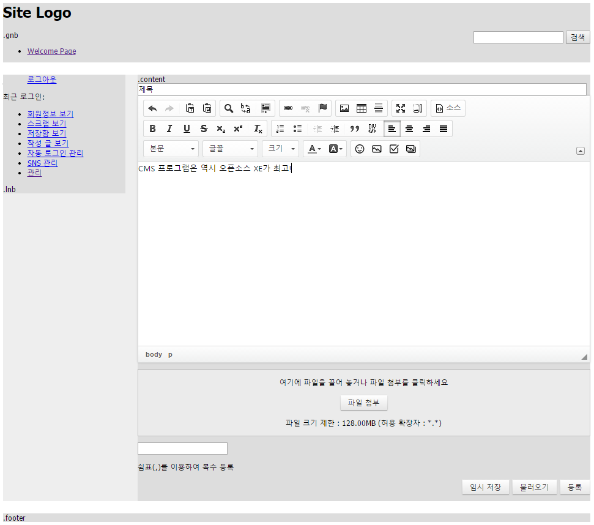

# 레이아웃 스킨 만들기

- [레이아웃 스킨이란](../../01_about_layout)
- [레이아웃 스킨의 위치와 디렉터리 구조](../../02_layout_structure)
 - [레이아웃 스킨의 위치 확인](../../02_layout_structure/confirm_directory)
 - [레이아웃 스킨 디렉터리 구조](../../02_layout_structure/directory_structure)
- [레이아웃 스킨 정보 작성](../../03_write_layout_info)
- [레이아웃 생성](../../04_make_layout_instance)
 - [사용자 정의 레이아웃 확인](../../04_make_layout_instance/confirm_user_defined_layout)
 - [레이아웃 사본 생성](../../04_make_layout_instance/copy_layout)
- [레이아웃 스킨 작성](../../05_write_layout)
 - [레이아웃 스킨의 문서 구조](../../05_write_layout/layout_structure)
 - [{$content} 변수로 본문 출력](../../05_write_layout/print_content)
 - [글로벌 메뉴 출력](../../05_write_layout/print_global_menu)
 - [로컬 메뉴 출력](../../05_write_layout/print_local_menu)
 - [통합검색 양식 출력](../../05_write_layout/print_search_form)
 - [로그인 양식 출력](../../05_write_layout/print_login_form)
- [사이트맵 작성](../../06_write_sitemap)
- [레이아웃에 사이트맵 연결](../../07_link_sitemap)
- [페이지 모듈에 레이아웃 연결](../)
 - [페이지 생성](../make_page)
 - [페이지 확인](../confirm_page)
 - 페이지 수정

## 페이지 수정

[페이지 확인](../confirm_page)에서 본 화면에서 페이지에 새로운 내용을 입력할 수 있습니다. 페이지를 수정하는 방법은 다음과 같습니다.

1. 레이아웃 스킨이 적용된 페이지에서 화면 오른쪽 아래에 있는 페이지 수정을 클릭합니다.
2. 간단한 제목과 본문 내용을 추가하고 등록을 클릭합니다. 추가한 내용이 페이지에 반영됩니다.
3. 사용자 화면에 표시되는 결과 화면은 다음과 같습니다. content 영역 오른쪽 아래에 표시되는 설정, 페이지 수정은 현재 페이지 모듈의 편집 권한이 있는 관리자에게만 표시되고 사용자 화면에는 표시되지 않습니다.

