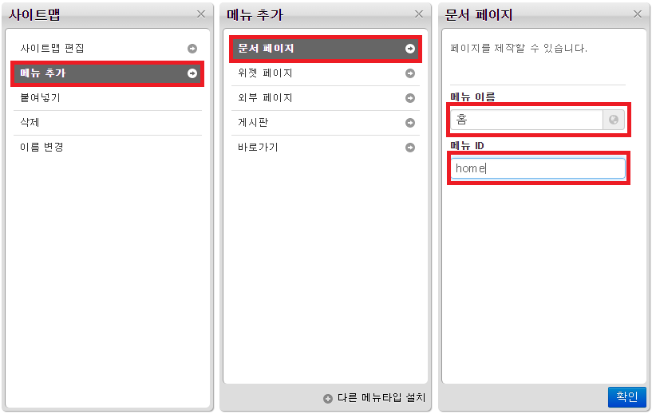
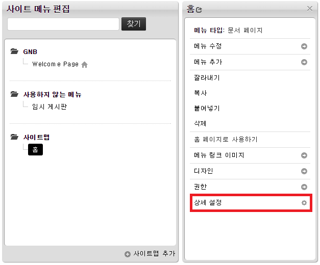
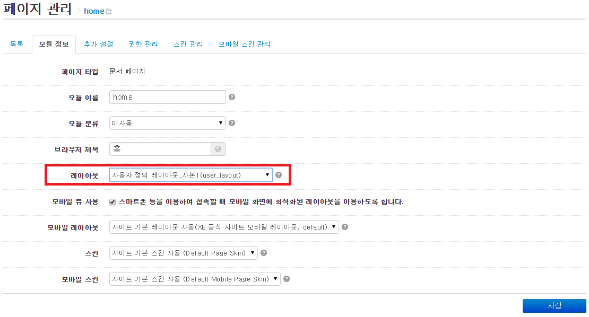

# 레이아웃 스킨 만들기

- [레이아웃 스킨이란](../../01_about_layout)
- [레이아웃 스킨의 위치와 디렉터리 구조](../../02_layout_structure)
 - [레이아웃 스킨의 위치 확인](../../02_layout_structure/confirm_directory)
 - [레이아웃 스킨 디렉터리 구조](../../02_layout_structure/directory_structure)
- [레이아웃 스킨 정보 작성](../../03_write_layout_info)
- [레이아웃 생성](../../04_make_layout_instance)
 - [사용자 정의 레이아웃 확인](../../04_make_layout_instance/confirm_user_defined_layout)
 - [레이아웃 사본 생성](../../04_make_layout_instance/copy_layout)
- [레이아웃 스킨 작성](../../05_write_layout)
 - [레이아웃 스킨의 문서 구조](../../05_write_layout/layout_structure)
 - [{$content} 변수로 본문 출력](../../05_write_layout/print_content)
 - [글로벌 메뉴 출력](../../05_write_layout/print_global_menu)
 - [로컬 메뉴 출력](../../05_write_layout/print_local_menu)
 - [통합검색 양식 출력](../../05_write_layout/print_search_form)
 - [로그인 양식 출력](../../05_write_layout/print_login_form)
- [사이트맵 작성](../../06_write_sitemap)
- [레이아웃에 사이트맵 연결](../../07_link_sitemap)
- [페이지 모듈에 레이아웃 연결](../)
 - 페이지 생성
 - [페이지 확인](../confirm_page)
 - [페이지 수정](../edit_page)

## 페이지 생성

1. XE 관리자 페이지에서 *사이트 제작/편집 > 사이트 메뉴 편집*을 선택합니다.
2. *사이트맵*을 선택한 후 옆의 *메뉴 추가*를 클릭합니다.
3. *문서 페이지*를 선택하여 *메뉴 이름(브라우저 제목)*, *메뉴 ID*를 입력합니다. 이 예제에서는 다음과 같이 설정하고 저장합니다.
 - 메뉴 이름 `홈`
 - 메뉴 ID `home`
4. *사이트맵*에 *홈*이 생성된 것을 확인한 다음 *홈*의 *상세 설정*을 클릭해 페이지 관리 화면으로 이동합니다.
5. 페이지 관리의 *레이아웃* 항목에서 *사용자 정의 레이아웃_사본1(user_layout)*을 선택하고 저장을 클릭합니다.

> 레이아웃에 *사용자 정의 레이아웃_사본1(user_layout)* 항목이 보이지 않는다면 *user_layout*의 사본이 아직 생성되지 않은 것입니다. *user_layout*의 사본을 생성하는 방법은 [레이아웃 사본 생성](../../04_make_layout_instance/copy_layout)을 참조하십시오.
