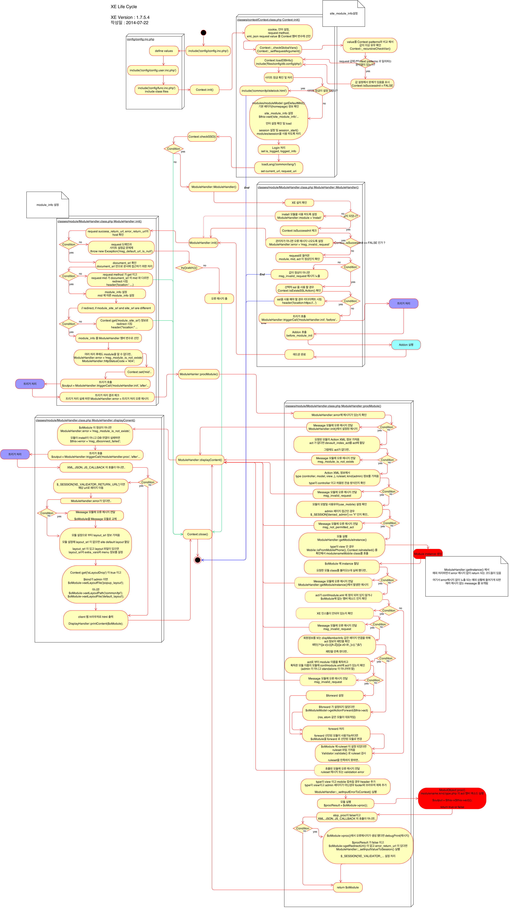

# XE core 이해하기

- [개요](../Summary)
- XE 라이프사이클

## XE 라이프사이클

XE 요청 라이프사이클이란 URL에 접속한 순간부터 클라이언트에 응답을 보낸 순간까지 XE가 거치는 일련의 과정을 나타냅니다. 다음은 XE 요청 라이프사이클을 나타낸 그림입니다.

이 파일의 원본은 [이곳](./doc/Lifecycle.pdf)과 [이곳](./doc/Lifecycle.xml)을 눌러 다운로드 받을 수 있습니다.

개발자는 애드온을 사용해서 이 라이프사이클의 특정 순간에 커스텀 코드를 실행할 수 있습니다. 애드온은 XE 추가 기능의 일종으로서, PHP include 메커니즘으로 작동합니다. 코드가 직접 코어 메서드에 포함되기 때문에 라이프사이클을 조작하는 기능을 구현할 수 있습니다. 애드온에 관한 자세한 설명은 [2.2 애드온]()을 참조하십시오.